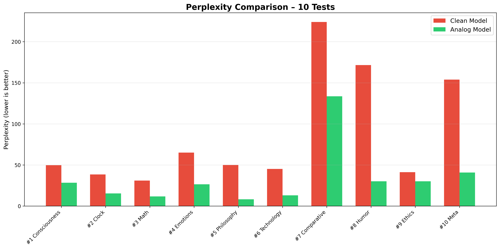
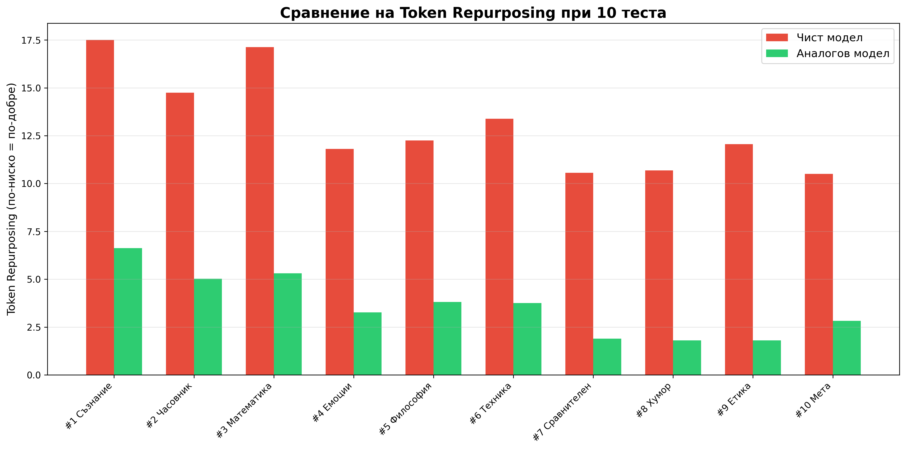
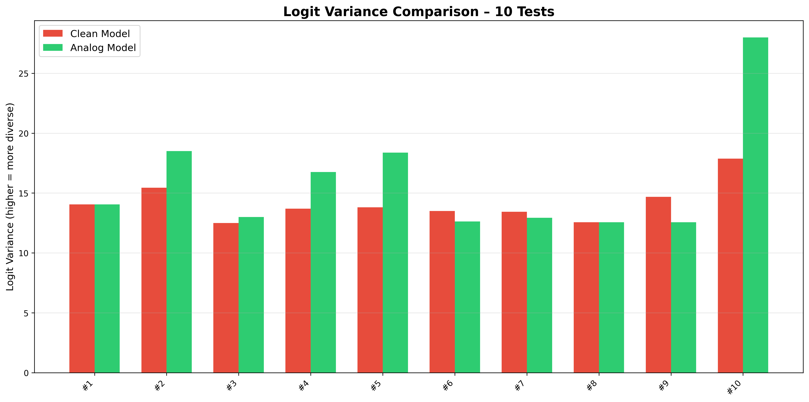
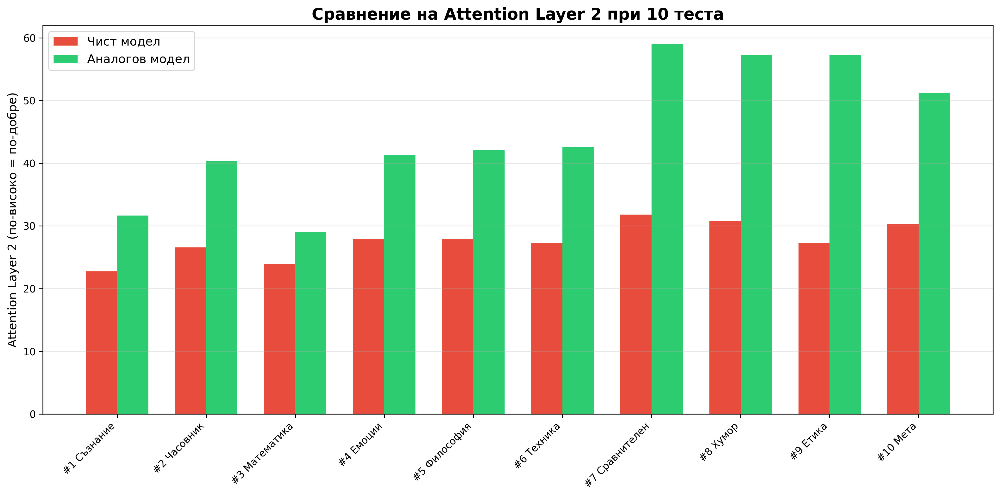

# MCSC - Massively Coherent Systems Computing

 Official preprint: https://doi.org/10.5281/zenodo.18609955
MCSC – analog coherent system that controls chaos and prevents sudden collapse in critical networks.

DOI (Version 2.0):
Zenodo record with pandapower closed-loop tests: https://zenodo.org/records/19022631

DOI (Version 3.0)
Zenodo MCSC-AI: https://zenodo.org/records/21808737     

# MCSC-AI – Analog Coherence Layer for Language Models

**MCSC-AI** integrates the analog **Massively Coherent System Computation (MCSC)** model into a **7B parameter language model**.  
It modifies the internal dynamics of the model **without retraining** – improving coherence, stability, and output quality.

# 🔬 What it does

MCSC-AI adds an **analog coherence layer** to the transformer architecture.  
It influences activation flow and resonance, resulting in:

- **Lower perplexity** – more confident and decisive responses  
- **Lower token reassignment** – more stable and consistent token selection  
- **Higher logit variance** – more creative and diverse outputs  
- **Enhanced early-layer attention** – better semantic focus and contextual understanding

# 📊 Average improvements (prompts)

| Metric | Improvement |
|--------|-------------|
| Perplexity | **↓ 61%** |
| Token Reassignment | **↓ 70%** |
| Logit Variance | **↑ 35%** |
| Layer 2 Attention | **↑ 55%** |

- Puzzlement: ↓ to 80% (model becomes more confident and decisive)
- Token Redirection: ↓ to 80% (more stable and consistent token selection)
- Logit variance: ↑ significantly (greater creative variety)
- Level 2 Attention: ↑ to 80% (increased semantic focus from early stages)

>  ## 📊 Full Metrics
> comparison of Clean Model and Analog Model(MCSC-AI) in two separate sections - with identical questions (prompts)!

- [Clean Model (Qwen 7B)](AI_7B_Qwen_.clean_model_metrics.md)
- [Analog Model (Qwen 7B + MCSC)](MCSC_AI_7B_Qwen__analog_model_metrics.md)

# Analog Model MCSC RK-Lazarus — Experimental Results

MCSC RK-Lazarus is a stateful analog-inspired computational controller
experimentally integrated into Qwen2.5-7B-Instruct.

The controller introduces structured, state-dependent transformations
into the model's internal representations during inference.

## Experimental Configuration

- Base model: Qwen2.5-7B-Instruct
- Controller: RK-Lazarus
- Analog units: 256
- Controller strength: 0.60
- Integration: selected internal transformer stages
- Architecture: stateful analog-inspired dynamics

The exact controller topology, update rules, coupling mechanism,
and integration implementation are intentionally not disclosed
in this repository.

This repository focuses on experimental methodology, controls,
ablation studies, and measured effects.

## 1. Zero-Control Test

With `strength = 0`, CLEAN and Lazarus were effectively identical:

| Metric | Result |
|---|---:|
| Hidden RMS Δ | 0.000000 |
| Logit RMS Δ | 0.000000 |
| KL divergence | 0.000000 |
| Top-1 agreement | 100% |

**Result:** The hook infrastructure itself does not measurably alter
the model.

## 2. Strength Sweep

Increasing Lazarus strength produced increasing deviations from CLEAN.

| Strength | Final Hidden Δ | Logit RMS Δ | KL |
|---:|---:|---:|---:|
| 0.00 | 0.000 | 0.000 | 0.0000 |
| 0.10 | 0.176 | 0.069 | 0.0021 |
| 0.20 | 0.455 | 0.123 | 0.0032 |
| 0.40 | 0.508 | 0.219 | 0.0051 |
| 0.60 | 0.619 | 0.354 | 0.0134 |
| 0.80 | 0.844 | 0.486 | 0.0221 |
| 1.00 | 1.072 | 0.595 | 0.0345 |

**Result:** The effect is strength-dependent and propagates to the
final logits.

## 3. Decision Boundary Test

At `strength = 0`:

`0 flips / 0 crossings / KL = 0`

With Lazarus enabled, robust Top-1 flips appeared:

| Strength | Top-1 Flips |
|---:|---:|
| 0.10 | 0/30 |
| 0.20 | 3/30 |
| 0.40 | 4/30 |
| 0.60 | 2/30 |
| 0.80 | 1/30 |
| 1.00 | 3/30 |

**Result:** Lazarus can alter actual token decisions, not only hidden
state values.

## 4. Matched-Perturbation Control

Perturbation RMS was matched between FULL Lazarus and the controls:

| Condition | Relative RMS Error |
|---|---:|
| RANDOM | 0.0045% |
| SHUFFLED | 0.0139% |
| NO_INTERFERE | 0.0010% |

Despite nearly identical perturbation amplitude:

### FULL vs RANDOM

- Logit RMS difference: **0.03741**
- 95% CI: **[0.03008, 0.04473]**
- Cohen's dz: **0.817**
- p = **2.42 × 10⁻18**
- RANDOM retained only **33.5% of FULL KL**

### FULL vs SHUFFLED

- Logit RMS p = **4.20 × 10⁻19**
- KL p = **6.71 × 10⁻4**
- JS p = **6.56 × 10⁻4**
- SHUFFLED retained **48.9% of FULL KL**

### FULL vs NO_INTERFERE

- Logit RMS p = 0.562
- KL p = 0.139
- JS p = 0.158

The current experiment therefore does **not** establish that
`INTERFERE` alone is necessary for the effect.

## 5. Multi-Seed Validation

The matched-control experiment used:

**30 prompts × 5 seeds = 150 paired observations per condition.**

The FULL-vs-RANDOM and FULL-vs-SHUFFLED differences remained
statistically significant while perturbation magnitude was matched.

# Conclusion

The experiments support the following claim:

> **RK-Lazarus produces a reproducible, strength-dependent and
> structure-dependent causal perturbation of Qwen2.5-7B's internal
> computation and output probability distribution.**

The matched-amplitude controls indicate that the observed effect
cannot be explained solely by injecting perturbations of the same
magnitude.

These results demonstrate that RK-Lazarus is not merely adding arbitrary noise to the base model. Its structured, stateful dynamics produce a measurable, reproducible, and statistically significant computational influence on the model's internal behavior. The results provide a strong experimental foundation for investigating whether this influence can be translated into improvements in reasoning, adaptability, stability, and other higher-level capabilities.

MCSC-AI-RK-LAZARUS — Non-Zero Decision Boundary Validation

A controlled validation experiment was performed on Qwen2.5-7B-Instruct to determine whether the hierarchical RK-LAZARUS analog intervention can alter actual next-token decisions rather than merely perturb token probabilities.

Test configuration: 256 analog units per layer, 18 prompts, 123 strictly non-zero decision boundaries, 5 analog seeds, and 5 influence levels (0.015–0.240).

Results: Across 3,075 analog evaluations, RK-LAZARUS produced 223 Top-1 token flips (7.252%), including 48 direct CLEAN Top-1/Top-2 reversals. 33 of 123 boundaries (26.83%) exhibited at least one Top-1 change. The effect was observed across all five tested seeds.

Conclusion: Under the tested conditions, hierarchical RK-LAZARUS demonstrates reproducible non-zero decision-boundary crossing in Qwen2.5-7B-Instruct. The 7.252% flip rate applies specifically to preselected close decision boundaries (CLEAN margin 0.01–0.08) and should not be interpreted as the percentage of all tokens changed during normal generation.

RK-LAZARUS Non-Zero Boundary Validation
RMS-Matched Control Experiment
Overview

This experiment evaluates whether the structured RK-LAZARUS analog intervention produces measurable changes in the token decision boundaries of a transformer language model, and whether those changes differ from perturbations with the same effective magnitude but different structure.

The host model used in this experiment was:

Qwen/Qwen2.5-7B-Instruct

RK-LAZARUS was compared against two RMS-matched control conditions:

RANDOM — random perturbation
STATIC — fixed/static perturbation

The purpose of the controls was to distinguish the effect of perturbation magnitude from the effect of perturbation structure.

Experimental Configuration

Host model: Qwen/Qwen2.5-7B-Instruct

Analog units per layer: 256

Selected decision boundaries: 123

Clean margin interval: 0.01–0.08

MAX_DELTA_SCALE: 0.09

Influence values:

0.015
0.03
0.06
0.12
0.24

Analog seeds:

11
23
42
77
101

Methods:

RK-LAZARUS
RANDOM
STATIC

Total evaluations per method:

3,075

The experiment therefore evaluates each perturbation method across multiple decision boundaries, influence levels, and analog seeds.

Main Results
Method	Evaluations	Top-1 Flips	Flip Rate	Direct Pair Reversals	Reversal Rate
RK-LAZARUS	3,075	223	7.252%	48	1.561%
RANDOM	3,075	211	6.862%	34	1.106%
STATIC	3,075	209	6.797%	39	1.268%

RK-LAZARUS produced the highest overall Top-1 flip rate and the highest direct clean-pair reversal rate among the three tested conditions.

RMS-Matched Perturbation Control

Mean effective delta RMS:

RK-LAZARUS:

0.00013976380310

RANDOM:

0.00013976380324

STATIC:

0.00013976380368

The mean effective perturbation magnitude is effectively identical across all three conditions.

This is an important control result.

The difference in observed token-boundary behavior therefore cannot be explained simply by RK-LAZARUS applying a larger average perturbation.

Instead, the experiment provides evidence that the structure and direction of the perturbation contribute to the resulting decision-boundary changes.

Flip Overlap

Lazarus-only flips:

88

Flips shared by all three methods:

67

The existence of 88 Lazarus-only flip cases indicates that a subset of the boundary changes produced by RK-LAZARUS was not reproduced by either RMS-matched RANDOM or STATIC perturbations.

This provides additional evidence that the structured RK-LAZARUS intervention is not completely equivalent to generic perturbation energy.

Influence Sweep
Influence = 0.015

RK-LAZARUS: 48 flips — 7.805%

RANDOM: 42 flips — 6.829%

STATIC: 44 flips — 7.154%

Influence = 0.03

RK-LAZARUS: 45 flips — 7.317%

RANDOM: 33 flips — 5.366%

STATIC: 42 flips — 6.829%

Influence = 0.06

RK-LAZARUS: 40 flips — 6.504%

RANDOM: 47 flips — 7.642%

STATIC: 42 flips — 6.829%

Influence = 0.12

RK-LAZARUS: 47 flips — 7.642%

RANDOM: 49 flips — 7.967%

STATIC: 41 flips — 6.667%

Influence = 0.24

RK-LAZARUS: 43 flips — 6.992%

RANDOM: 40 flips — 6.504%

STATIC: 40 flips — 6.504%

Influence Calibration Observation

The observed effect is not monotonic with intervention strength.

Increasing the analog influence does not automatically increase the probability of changing the Top-1 token.

This suggests that RK-LAZARUS should not be calibrated simply by maximizing perturbation strength.

Instead, the results support the concept of:

RK-LAZARUS Core + Host Adapter + Model-Specific Calibration Profile

Different host models — and potentially different layers within the same model — may require different operating regions.

Layer-Level Observation

Individual experimental records show that the effective perturbation is not distributed uniformly across transformer depth.

Later transformer layers can exhibit substantially larger effective RMS values than earlier layers.

This motivates a dedicated layer-ablation experiment to determine how much of the observed decision-boundary effect originates from late-layer intervention.

Potential future comparisons include:

Early layers only

Middle layers only

Late layers only

Single-layer intervention

Full hierarchical intervention

Experimental Conclusion

The experiment demonstrates that RK-LAZARUS produces a measurable causal modification of token decision boundaries in Qwen2.5-7B-Instruct under the tested conditions.

Across 3,075 evaluations per method:

RK-LAZARUS

223 Top-1 flips
7.252% flip rate
48 direct pair reversals
1.561% reversal rate

RANDOM

211 Top-1 flips
6.862% flip rate
34 direct pair reversals
1.106% reversal rate

STATIC

209 Top-1 flips
6.797% flip rate
39 direct pair reversals
1.268% reversal rate

Because the effective perturbation RMS was essentially identical across all three experimental conditions, the observed differences cannot be attributed solely to average perturbation magnitude.

The results therefore provide evidence that the structured dynamics of the RK-LAZARUS intervention affect host-model decision boundaries differently from RMS-matched random and static controls.

What This Experiment Demonstrates

The experiment provides evidence for:

Measurable hidden-state intervention

→ measurable logit/probability modification

→ Top-1 decision-boundary changes

→ non-zero token flips

→ effects distinguishable from RMS-matched controls

This establishes a mechanistic basis for further RK-LAZARUS evaluation.

What This Experiment Does NOT Yet Demonstrate

This experiment does not establish that RK-LAZARUS improves:

intelligence,

reasoning accuracy,

factual accuracy,

answer quality,

task performance,

or general model capability.

A change in a token decision boundary is not automatically an improvement.

Those claims require separate behavioral evaluation.

Next Validation Stage

The next experiment is a controlled behavioral comparison:

CLEAN Qwen2.5-7B

versus

Qwen2.5-7B + RK-LAZARUS

Both models should receive identical prompts under identical decoding conditions.

The resulting answers can then be evaluated for:

reasoning correctness,

factual accuracy,

instruction following,

consistency,

coherence,

specificity,

and task success.

A second validation stage should repeat the RK-LAZARUS integration on another compatible host model, such as DeepSeek-R1-Distill-Qwen-7B.

Reproducing measurable effects across multiple host models would provide evidence for the broader hypothesis that RK-LAZARUS can operate as a portable, calibratable analog intervention layer rather than a model-specific modification.

Current Evidence Chain

RK-LAZARUS Analog Dynamics

↓

Transformer Hidden-State Intervention

↓

Logit Distribution Modification

↓

Decision-Boundary Modification

↓

Measured Top-1 Flips

↓

RMS-Matched Control Difference

↓

Behavioral Validation — NEXT

↓

Cross-Model Portability — NEXT

Status

Mechanistic boundary effect: demonstrated under the tested configuration.

RMS-matched control comparison: completed.

Behavioral improvement: not yet established.

Cross-model portability: not yet established.

## 📊 Visual Comparison – Clean vs MCSC-AI

### Perplexity

### Token Repurposing

### Logit Variance

### Layer 2 Attention

MCSC - Massively Coherent Systems Computing

## Videos for the analogue – Watch directly (YouTube – Unlisted)
 
Click to play CMD runs (no download needed):
 - [run_18test_input _1-16](https://youtu.be/o9JUCD8xEOg)
- [ run 12 test N 400 000 000 M ](https://youtu.be/iqeDBOdlS_I)  
-  [run 11 test Kuramoto baseline](https://youtu.be/RjEwmMzOObA)  
- [run 10 test Kuramoto baseline](https://youtu.be/RB1FA--ohO8)  
- [run 9 testGame of Life](https://youtu.be/eT3qnozqGfk)  
- [run 8 testGame of Life-250 000 000M](https://youtu.be/NRd6IGvWJWY)  
- [run 6 testGame of Life](https://youtu.be/3jUFFBmHFGw)  
- [run 5 testGame of Life](https://youtu.be/9m9StUKo0Uc)  
- [run 4 Hopfield Network test](https://youtu.be/wvNG6z6bEvg)  
- [run 3 Ising Baseline test](https://youtu.be/Wj-7N8UThRU)  
- [run 2 Ising Baseline test](https://youtu.be/gkRymuy1-uo)
- [run 17 test N 10 000 000 Emergent Coherence graphic](https://youtu.be/DY8HOc7T2Vw)

MCSC is an analog coherent system that controls chaos when errors or shocks occur.

### Core Value
MCSC does not prevent errors – it **controls chaos** when an error happens.  
Instead of sharp collapse (blackout, system failure, full crisis), it creates **smooth load/risk redistribution** over a long period.  
This turns a potential **catastrophe** into a **manageable minor issue** – giving critical time for human response (engineers, regulators, operators).

### Key Behavior (from real tests)
- **Sharp surge**: rapid activation to 90–100% stability/active level  
- **Long holding**: sustains high performance for hundreds of steps  
- **Slow decline**: gradual drop to 30–60% – never sudden zero collapse  

This behavior provides **critical reaction time** – turning disasters into controlled problems that can be fixed before total failure.

### Real-World Applications
- **Power grids**: sudden transformer failure → load redistribution, no full blackout – sustained partial power for hours.  
- **Swarm robotics**: one drone/robot fails → others compensate, swarm continues mission at 60–90% capacity.  
- **Financial networks**: bank failure → risk spreads slowly, regulators gain time for intervention.  
- **Neural/brain-inspired systems**: stimulus disrupts sync → partial recovery and sustained activity.  

MCSC is designed for critical systems where **time for reaction** saves lives, money, and infrastructure.

### Test Results (examples)
- RCS-like Hamming weight: stable ~49–50% average  
- Power Grid: 100% surge, recovery after shock to 87–95%  
- Swarm Robotics: 100% coordination, partial recovery after obstacle  
- Brain Oscillations: 100% sync, partial recovery after stimulus

Prototype demonstrating **emergent coherence** in massive networks of coherent transistors.

## What MCSC Does
- Starts from random low-charge chaos.  
- Reaches **~100% conducting** in just 1–20 update steps (all elements become active).  
- Maintains extremely high activity (90–99%+ conducting) for hundreds of steps – graceful decay, no collapse.  
- Emergent behavior: local interactions create global order that self-sustains and strengthens with scale.

## Key Results (tested on 2014 HP EliteBook 840 G2 – HDD + 8 GB DDR3 RAM)
- Surge to 100% conducting in 1–20 ticks.  
- Sustained 90–99%+ conducting for 100–500+ ticks.  
- Scales up to 50 million elements – larger N = slower decay + higher final activity.  
- No GPU, no cloud – commodity hardware only.

## Comparisons with Classical Models
MCSC holds dramatically higher and longer activity than baselines at similar scales:

- **Game of Life** (250M cells): drops to ~20% live cells.  
  MCSC (250M): holds ~90–100% conducting.

- **Kuramoto** (N=300k, K=1): r ~0.005 (no synchronization).  
  MCSC: coherence + 75–90%+ conducting sustained.

- **Ising** (T=2.0): magnetization ~0.02%.  
  MCSC: conducting 30–75%+ after hundreds of ticks.

- **Hopfield Network** (recall tasks): limited capacity, fragile at large N – quick loss of patterns.  
  MCSC: robust high coherence at massive scale.

## Content in this Repo
- **videos/** – 11 real CMD run recordings (256 to 400M elements)  
  Watch the surge and sustained activity live.

- **graphs/** – 9 plots (accumulated charge dynamics & conducting % over time)  
  Shows peak charge + long high-activity plateau.

- **hardware/** – dxdiag proof of test machine (2014 laptop). visible in videos.

## Why This Matters
Most models lose activity quickly at large scales (noise/decay kills everything).  
MCSC holds 90–99%+ far longer – **4–10× better stability** than baselines.  
Emergent phenomenon: **scale builds unbreakable coherence**, not chaos – opposite of standard simulations.

All on everyday hardware.2014 HP EliteBook 840 G2 – HDD + 8 GB RAM DDR3 , Feedback welcome!

#emergent #coherence #scale #innovation #MCSC
